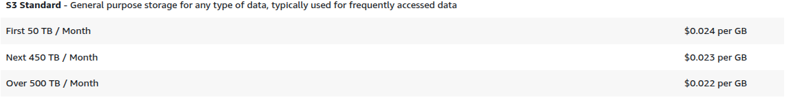
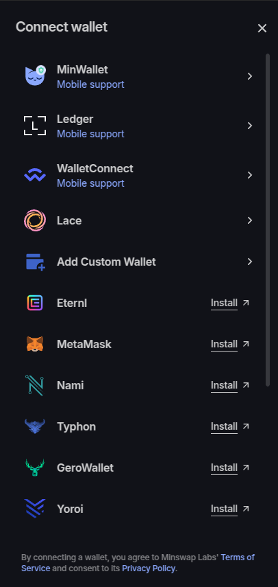
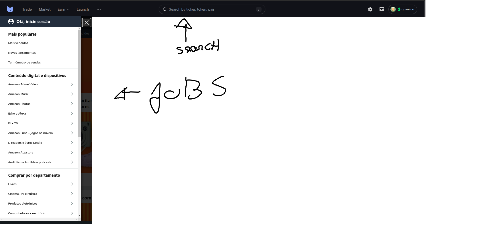
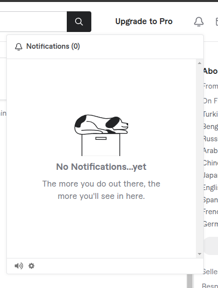
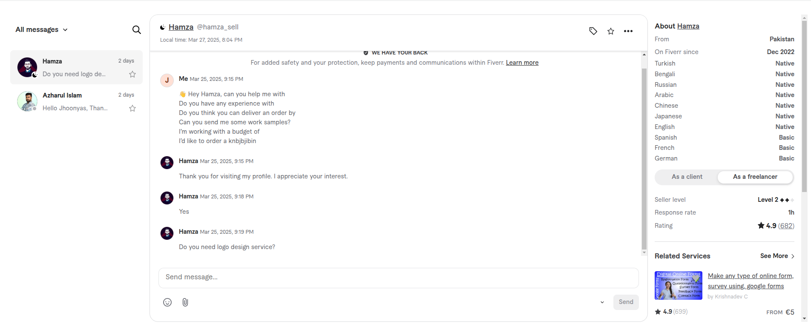
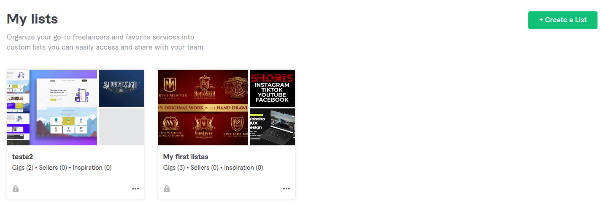
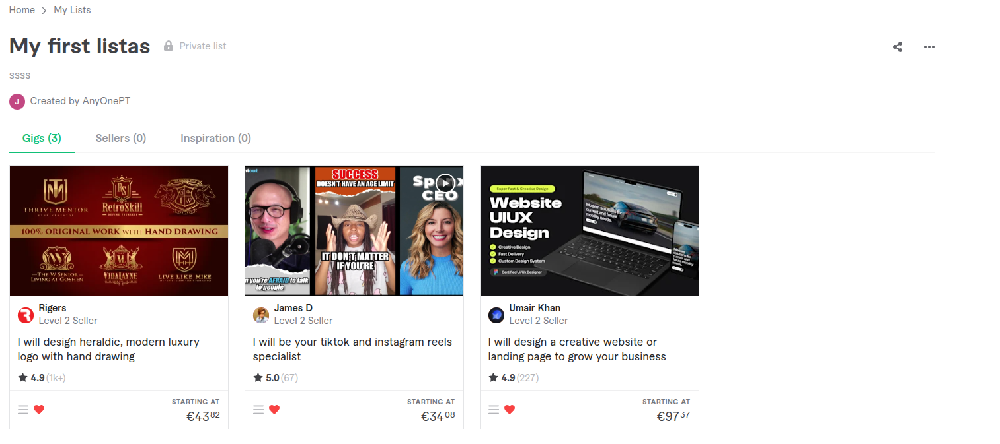

# Database
### SQL Database tables

- **users**: Stores user information, including roles, profiles foreign id, preferences  and details.​

- **user_roles**: Defines various roles and associates them with users.​

- **wallet_types**: Defines table to save all available wallet types

- **user_skills**: Defines skills for each user profile

- **profiles**: Contains detailed profiles for both clients and freelancers, such as portfolios and ratings.​

- **services**: This is a job that a freelancer created where multiple orders can be created from this job

- **service_status**: Holds information about all available service statuses

- **requests**: This is a job that a client created requesting a service to be performed where multiple proposals can be created from this job but only one proposal can be active

- **request_status**: Holds information about all available request statuses

- **milestones**: Manages agreements about job steps between clients and freelancers, tracking milestone progress and terms.​

- **milestone_status**: Holds information about all available milestone status

- **proposals**: When a client creates a request, freelancers can propose on milestones and rewards

- **proposal_status**: When a client creates a request, freelancers can propose on milestones and rewards

- **orders**: When a freelancer proposes a service, clients can queue up on orders.

- **orders_status**: When a freelancer proposes a service, clients can queue up on orders.

- **transactions**: Logs financial transactions, including payments, refunds, and escrow details.​

- **categories**: Saves all categories, which will have sub-categories.​

- **sub-categories**: Saves all sub-categories, which will have services and requests associated with them.​

- **reviews**: Captures feedback and ratings exchanged between clients and freelancers post-completion of services or requests.​

#### Relationships and Permissions:

- **User and Roles**: One Role has many users and one user can only have one role

- **User and wallet type**: One user has one wallet type, one wallet type has many users

- **Profile and Skills**: One Profile has many skills and one skill has many Profiles.

- **Requests and Milestone**: Implement a many-to-many relationship where each request can have multiple milestones.

- **Services and Milestone**: Implement a many-to-many relationship where each service can have multiple milestones.

- **Request and request status**: Implement a one-to-many relationship where each request has one status, one status has many requests.

- **service and service status**: Implement a one-to-many relationship where each service has one status, one status has many services.

- **services and sub-categories**: One-to-many relationship where one sub-category can have multiple services
- 
- **requests and sub-categories**: One-to-many relationship where one sub-category can have multiple requests

- **request and Proposal**: Implement a one-to-many relationship where each request can have multiple proposals.​

- **service and Order**: Implement a one-to-many relationship where each service can have multiple orders.​

- **Milestones and orders**: Implement a many-to-many relationship where each order has many milestones, one milestone has one order.

- **Milestones and proposals**: Implement a many-to-many relationship where each proposal has many milestones, one milestone has one proposal.

- **Milestone and milestone statuses**: Implement a one-to-many relationship where each milestone has one status and one status has many milestones

- **USERS and Services**: Set up a one-to-many relationship where a user can post multiple services.​
- 
- **USERS and requests**: Set up a one-to-many relationship where a user can post multiple requests.​

- **USER and Proposals**: Set up a one-to-many relationship where a user can post multiple proposals.​

- **USER and orders**: Set up a one-to-many relationship where a user can post multiple orders.​

- **service and Transactions**: Set up a one-to-many relationship where a service can have multiple transactions.​

- **request and Transactions**: Set up a one-to-many relationship where a request can have multiple transactions.​

- **order and Transactions**: Set up a one-to-many relationship where an order can have multiple transactions.​

- **proposal and Transactions**: Set up a one-to-many relationship where a proposal can have multiple transactions.​

- **categories and sub-categories**: One-to-many relationship where one category can have multiple sub-categories

- **reviews and users**: one-to-many relationship where one user can review multiple users, and one user can be reviewed by multiple users.


### NoSQL Database Collections

- **portfolios**: Contains detailed information about previous works of freelancer

- **messages**: Facilitates communication between users within the platform.​

- **notifications**: Manages system alerts and notifications for user activities.

- **wishlists**: Wishlists are a list of services or requests a user has liked


## Table Schemas
### SQL
  #### Users
  ```sql
  user_id(Integer, Primary),
  created_at(Datetime),
  updated_at(Datetime),
  is_activate(boolean),
  is_deleted(boolean),
  role_id(INT, NOT NULL, FOREIGN KEY),
  wallet_public_address(varchar(100), UNIQUE, NOT NULL),
  last_login(datetime),
  ```
  ```sql
  wallet_type_id(Integer, FOREIGN KEY, NOT NULL)
  ```
  Wallet_type will be an enum which will represent the wallet the user, uses :
  - 1 = Lace
  - 2 = Yoroi
  - etc..

  #### Wallet types
  ```
  wallet_type_id(INT, PRIMARY KEY)
  wallet_type_name(STRING)
  ```

  #### Roles
  ```sql
  role_id(INT, Primary)
  role_name(VARCHAR(50), NOT NULL, UNIQUE)
  role_description(TEXT) 
  ```

  #### user_skills
  ```sql
  skill_id(INT, Primary)
  keyword(VARCHAR(50), NOT NULL, UNIQUE)
  skill_description(TEXT)
  created_at = Column(TIMESTAMP, default=datetime.utcnow)
  updated_at = Column(TIMESTAMP(timezone=True), nullable=True, onupdate=datetime.now(timezone.utc))
  ```

  #### Profiles
  ```sql
  profile_id(INT, PRIMARY KEY)
  user_id(INT, NOT NULL, FOREIGN KEY),
  first_name(VARCHAR(50)),
  last_name(VARCHAR(50)),
  bio(text),
  location(varchar(100)),
  profile_picture(varchar(255)), // REFERENCE TO THE AWS S3 FILE STORAGE
  created_at = Column(TIMESTAMP, default=datetime.utcnow)
  updated_at = Column(TIMESTAMP(timezone=True), nullable=True, onupdate=datetime.now(timezone.utc))
  ```

 #### Services
 ```sql
  service_id(INT, PRIMARY),
  title(varchar(50)),
  description(TEXT),
  sub_category_id(INT, FOREIGN KEY),
  total_price(float, NULLABLE),
  tags(list of strings), //USE THIS TO SEARCH FOR A service BY KEYWORDS
  freelancer_id(INT, FOREIGN KEY)
  created_at(TIMESTAMP),
  updated_at(TIMESTAMP),
  service_status_id(Integer, FOREIGN KEY) REFERENCES service_status TABLE
  ```

  #### Service Status
 ```
  service_status_id(INT, PRIMARY)
  service_status_name(STRING)
  service_status_description(STRING)
 ```

 - **Canceled** 0
 - **Draft** 1
 - **Available** 2
 - **Closed** 3

 #### Requests
 ```sql
  request_id(INT, PRIMARY),
  title(varchar(50)),
  description(TEXT),
  sub_category_id(INT, FOREIGN KEY),
  total_price(float, NULLABLE),
  tags(list of strings), //USE THIS TO SEARCH FOR A request BY KEYWORDS
  client_id(INT, FOREIGN KEY)
  created_at(TIMESTAMP),
  updated_at(TIMESTAMP),
  request_status_id(Integer, FOREIGN KEY) REFERENCES request_stats TABLE
  ```

  #### request Status
 ```
  request_status_id(INT, PRIMARY)
  request_status_name(STRING)
  request_status_description(STRING)
 ```
 Status will have 6 different statuses :
 - **Canceled** (0 - When Job is canceled by the client or the freelancer)
 - **Draft** (1 - When a job has found a freelancer/client, and is approving milestones and rewards defined by the client/freelancer.)
 - **Pending Approval** (2 - When a job of type request or service is created, needs to be approved by platform, to see if it follows ToS)
 - **Approved** (3 - Ready to be displayed on the platform)
 - **Requesting Freelancer** (4 - When a job has found a freelancer/client, and is approving milestones and rewards defined by the client/freelancer.)
 - **In Progress** (5 - After the job is created and the funds are allocated on the smart contract)
 - **Completed** (6 - When all milestones are completed)

 #### **Milestones**
 ```sql
  milestone_id(INT, PRIMARY KEY),
  milestone_tx_hash(VARCHAR(100)) 
  ```
  THIS IS THE 'ID' OF THE UTXO INSIDE THE SMART CONTRACT, UTXO''s in this case are like items in a list, that list contains the approval status of the freelancer and the client.
  Grab this UTXO reference from the blockchain transaction response
  ```sql
  client_id(INT, FOREIGN KEY, NOT NULL),
  freelancer_id(INT, FOREIGN KEY, NOT NULL),
  milestone_text(TEXT, NOT NULL),
  reward_amount(FLOAT, NOT NULL),
  created_at = Column(TIMESTAMP, default=datetime.utcnow)
  updated_at = Column(TIMESTAMP(timezone=True), nullable=True, onupdate=datetime.now(timezone.utc))
  client_approved(Boolean),
  freelancer_approved(Boolean),
  milestone_status_id(Integer, FOREIGN KEY) REFERENCES MILESTONE_STATUS TABLE
   
 ```
  #### Milestone Status
```
  milestone_status_id(INT, PRIMARY)
  milestone_status_name(STRING)
  milestone_status_description(STRING)

  DRAFT = 0
  IN_PROGRESS = 1
  COMPLETED = 2
 ```

  #### proposals
  ```sql
  proposal_id(INT, PRIMARY KEY),
  request_id(INT, FOREIGN KEY), REFERENCES TABLE REQUESTS
  freelancer_id(INT, FOREIGN KEY) REFERENCES TABLE USERS
  proposal_status_id(Integer, Foreign key)
  created_at = Column(TIMESTAMP, default=datetime.utcnow)
  updated_at = Column(TIMESTAMP(timezone=True), nullable=True, onupdate=datetime.now(timezone.utc))
  ```

#### Proposal status
 ```sql
  proposal_status_id(INT, PRIMARY)
  proposal_status_name(STRING)
  proposal_status_description(STRING)
 ```
 Status will have 7 different statuses :
 - **Canceled** - 0
 - **Draft** - 1 
 - **Pending Approval** - 2 (Pending approval by client)
 - **Approved** - 3
 - **In Progress** - 4
 - **Completed** - 5
 - **Denied By client** - 6

  #### orders
  ```sql
  order_id(INT, PRIMARY KEY),
  order_id(INT, FOREIGN KEY, NOT NULL),
  milestone_id(INT, FOREIGN KEY),
  client_id(NT, FOREIGN KEY, NOT NULL)
  created_at = Column(TIMESTAMP, default=datetime.utcnow)
  updated_at = Column(TIMESTAMP(timezone=True), nullable=True, onupdate=datetime.now(timezone.utc))
  ```

#### orders status
 ```sql
  order_status_id(INT, PRIMARY)
  order_status_name(STRING)
  order_status_description(STRING)
 ```
 Status will have 7 different statuses :
 - **Canceled** - 0
 - **Draft** - 1 
 - **Pending Approval** - 2 (Pending approval by freelancer)
 - **Approved** - 3
 - **In Progress** - 4
 - **Completed** - 5
 - **Denied By client** - 6

  #### Transactions
  ```sql
  transaction_id(INT, PRIMARY KEY),
  milestone_id(INT, FOREIGN KEY, NOT NULL),
  amount(DECIMAL(10,2), NOT NULL)
  token_name(VARCHAR(50))
  receiver_address(TEXT)
  client_id(INT, FOREIGN KEY, NOT NULL)
  freelancer_id(INT, FOREIGN KEY, NOT NULL)
  created_at = Column(TIMESTAMP, default=datetime.utcnow)
  updated_at = Column(TIMESTAMP(timezone=True), nullable=True, onupdate=datetime.now(timezone.utc))
  ```

  #### Categories
  ```sql
  category_id(INT, PRIMARY KEY),
  category_name(varchar(50), NOT NULL),
  category_description(TEXT)
  created_at = Column(TIMESTAMP, default=datetime.utcnow)
  updated_at = Column(TIMESTAMP(timezone=True), nullable=True, onupdate=datetime.now(timezone.utc))
  ```

  #### Sub-Categories
  ```sql
  sub_category_id(INT, PRIMARY KEY),
  category_id(INT, FOREIGN KEY, NOT NULL),
  sub_category_name(VARCHAR(50), NOT NULL),
  sub_category_description(TEXT)
  created_at = Column(TIMESTAMP, default=datetime.utcnow)
  updated_at = Column(TIMESTAMP(timezone=True), nullable=True, onupdate=datetime.now(timezone.utc))
  ```

  #### Reviews
  ```sql
  review_id(INT, PRIMARY KEY)
  reviewee_id(INT, FOREIGN KEY, NOT NULL) // PERSON BEING REVIEWED
  reviewer_id(INT, FOREIGN KEY, NOT NULL)
  rating(decimal(2,1), NOT NULL CHECK(rating >= 1.0 AND rating <= 5.0))
  comment(TEXT)
  created_at = Column(TIMESTAMP, default=datetime.utcnow)
  updated_at = Column(TIMESTAMP(timezone=True), nullable=True, onupdate=datetime.now(timezone.utc))
  ```

  ### NoSQL

  #### Portfolios
  ```JSON
    user_id: int
    portfolio_id: int
    projects: [
      {
        "project_title": str,
        "description": str,
        "start_date": datetime,
        "completion_date": datetime,
        "tech_stack": List[str]
        images : [
          {
            image_reference: str // Reference to AWS S3 ID
            file_type: str
          }
        ]
        attachments: [
          {
              "file_reference": str, // Reference to AWS S3 ID
              "file_type": str,
          }
        ]
      }
    ]
  ```

  #### Messages
  ```JSON
  message_id: int
  sender_id: int
  receiver_id: int
  content: str
  sent_time: datetime
  received_time: datetime
  is_edited: boolean
  is_viewed: boolean
  ```

  #### Notifications
  ```JSON
  notification_id: int
  user_id: int
  content: str
  creation_date: datetime
  was_notified: boolean
  ```

  #### Wishlists
  ```JSON
  user_id: int
  lists: [
    "webdevelopment_indian_content": {
      creation_date: datetime
      description: string
      lists: {
        "services": [service_id_1, service_id_2, service_id_3],
        "requests": [request_id_1, request_id_2, request_id_3]
      }
    },
    "kamasutra": {
      creation_date: datetime
      description: string
      lists: {
        "services": [service_id_1, service_id_2, service_id_3],
        "requests": [request_id_1, request_id_2, request_id_3]
      }
    },
    "watch later": {
      creation_date: datetime
      description: string
      lists: {
        "services": [service_id_1, service_id_2, service_id_3],
        "requests": [request_id_1, request_id_2, request_id_3]
      }
    },
  ]
  ```

# Roles

###  User Roles
- Admin
- User
- Guest


## Backend

### Sockets for Notifications and Messages
```
Create a class to 
- Dispatch message information
- Dispatch new notifications
```

### File Storage
- **File Storage:** AWS S3 Storage // Localstack for a local environment emulator of AWS S3

```
  Images, Files, Documents will be saved on AWS S3 File Storage provider. 
  On the databases there will be no binary file data, only the reference to later query from the file storage provider
```

#### Implementation
Create class **Storage**
  Here you will be able to  
  - Create an item inside storage and return the reference to be stored on SQL or No-SQL Database
  - Delete an item inside storage and return a boolean
  - Get an item from inside the storage.

#### Considerations

##### Compress files before uploading to avoid unnecessary costs.
  -  Use jpegoptim library for image compression

##### Pricing


## **Role-Based Access Control (RBAC)**: 

Example 
```JSON
  "admin": {
    "tests": {
      "description": "Permissions related to test management.",
      "untaken": {
        "able": true,
        "description": "Permissions for untaken tests.",
        "view": {
          "description": "View-related permissions.",
          "can_view_own": true,
          "can_view_shared": true,
          "can_view_own_practice": true,
          "can_view_all": true
        },
        "send": {
          "description": "Send-related permissions.",
          "can_send_own": true,
          "can_send_shared": true,
          "can_send_own_practice": false,
          "can_send_all": true
        },
        "update": {
          "description": "Update-related permissions.",
          "can_update_own": true,
          "can_update_shared": true,
          "can_update_own_practice": false,
          "can_update_all": true
        },
        "create": {
          "description": "Create-related permissions.",
          "able": true
        },
        "manage": {
          "description": "Manage-related permissions.",
          "can_manage_own": true,
          "can_manage_shared": true,
          "can_manage_own_practice": false,
          "can_manage_all": true
        },
        "delete": {
          "description": "Delete-related permissions.",
          "can_delete_own": true,
          "can_delete_shared": true,
          "can_delete_own_practice": true,
          "can_delete_all": true
        }
      },
      "taken": {
        "description": "Permissions for taken tests.",
        "can_create_pdf": true,
        "able": true,
        "view": {
          "description": "View-related permissions.",
          "can_view_own": true,
          "can_view_shared": true,
          "can_view_own_practice": true,
          "can_view_all": true
        },
        "send": {
          "description": "Send-related permissions.",
          "can_send_own": true,
          "can_send_shared": true,
          "can_send_own_practice": true,
          "can_send_all": true
        },
        "update": {
          "description": "Update-related permissions.",
          "can_update_own": true,
          "can_update_shared": true,
          "can_update_own_practice": true,
          "can_update_all": true
        },
        "manage": {
          "description": "Manage-related permissions.",
          "can_manage_own": true,
          "can_manage_shared": true,
          "can_manage_own_practice": true,
          "can_manage_all": true
        },
        "archive": {
          "description": "Archive-related permissions.",
          "can_archive_own": true,
          "can_archive_shared": true,
          "can_archive_own_practice": true,
          "can_archive_all": true
        }
      },
      "duplicate": true
    },
  }
```

### Middlewares
```
login_validator - verify JWT token, check if user is logged in to access private endpoints.
role_validator - Verify Role inside jwt token, to check if user has permissions to access endpoint.
```

### Endpoints

#### Auth
```
 - POST **/login** Form(signed_transaction: str) -> JWT Token - Login user by checking signed transaction, if valid, return JWT Token with signature.
 - POST **/authorization** Form(route: str) -> bool - If user attempts at accessing private route, check with API if user has permissions
```

#### Users
```
 - GET **/user** Query(user_id: int) -> User - GET SINGLE USER
 - GET **/users** -> List[User] - GET ALL USERS
 - GET **/users/service** Query(service_id: int) -> List[User] - GET ALL USERS by service
 - GET **/users/request** Query(request_id: int) -> List[User] - GET ALL USERS by request
 - DELETE **/user** Query(user_id: int) -> Bool - SOFT DELETE SINGLE USER BY ID
 - POST **/user** FORM(user_id, user_data: dict) -> Bool - CREATE USER WITH DATA
 - PATCH **/user** FORM(user_id: int, user_data: dict) -> Bool - EDIT USER WITH DATA
 ```

#### User Roles
```
 - GET **/user/role** Query(user_id: int) -> Role - GET ROLE OF USER
 - GET **/roles** -> List[Role] - GET ALL Roles
```
#### Profiles
```
 - GET **/user/profile** Query(user_id: int) -> Profile - GET SINGLE USER PROFILE
 - POST **/user/profile** FORM(user_id: int, user_profile: dict) -> Bool - CREATE PROFILE FOR SPECIFIC USER
 - PATCH **/user/profile** FORM(user_id: int, user_profile: dict) -> Bool - EDIT PROFILE OF USER SPECIFIED
 - DELETE **/user/profile** Query(user_id: int) -> Bool - DELETE SINGLE Profile BY user id
```
 #### Portfolios
 ```
 - GET **/user/portfolio** Query(user_id: int) -> Portfolio - GET SINGLE USER portfolio
 - POST **/user/portfolio** FORM(user_id: int, user_portfolio: dict) -> Bool - CREATE portfolio FOR SPECIFIC USER
 - PATCH **/user/portfolio** FORM(user_id: int, user_portfolio: dict) -> Bool - EDIT portfolio OF USER SPECIFIED
 - DELETE **/user/portfolio** Query(user_id: int) -> Bool - DELETE SINGLE Portfolio BY user id
```
#### Reviews
```
 - GET **/user/review** Query(review_id: int) -> Review - GET SINGLE review
 - GET **/user/reviews** Query(user_id: int) -> List[Review] - GET ALL Reviews by User
 - POST **/user/review** FORM(user_id: int, review_data: dict) -> Bool - CREATE review FOR SPECIFIC USER
 - PATCH **/user/review** FORM(user_id: int, review_data: dict) -> Bool - EDIT review OF USER SPECIFIED
 - DELETE **/user/review** Query(review_id: int) -> Bool - DELETE SINGLE Review BY ID
```
#### Requests
```
 - GET **/request** Query(request_id: int) -> Request - GET SINGLE Request
 - GET **/requests** -> List[Requests] - GET ALL Requests
 - GET **/user/requests** Query(user_id: int) -> List[Requests] - GET ALL REQUESTS RELATED TO A USER
 - GET **/sub-category/requests** Query(category_id: int) -> List[Requests] - GET ALL requests related to sub-category
 - DELETE **/request** Query(request_id: int) -> Bool - DELETE SINGLE request BY ID
 - POST **/request** FORM(request_id: id, request_data: dict) -> Bool - CREATE Request WITH DATA
 - PATCH **/request** FORM(request_id: int, request_data: dict) -> Bool - Update request by request_id
 - PATCH **/request/status** FORM(request_id: int, request_status_id: int) -> Bool - Update request by request_id
```

#### Service
```
 - GET **/service** Query(service_id: int) -> Service - GET SINGLE Request
 - GET **/services** -> List[Services] - GET ALL SERVICES
 - GET **/user/services** Query(user_id: int) -> List[Services] - GET ALL SERVICES RELATED TO A USER
 - GET **/sub-category/services** Query(category_id: int) -> List[Services] - GET ALL services related to category
 - DELETE **/service** Query(service_id: int) -> Bool - DELETE SINGLE SERVICE BY ID
 - POST **/service** FORM(service_data: dict) -> Bool - CREATE SERVICE WITH DATA
 - PATCH **/service** FORM(service_id: int, service_data: dict) -> Bool - Update service by service_id
 - PATCH **/service/status** FORM(service_id: int, service_status_id: int) -> Bool - Update service by service_id
```

#### milestones
```
 - GET **/milestone** Query(milestone_id: int) -> milestone - GET SINGLE milestone
 
 - GET **/service/milestones** Query(service_id: int) -> List[milestones] - GET ALL milestones from specific service
 - GET **/request/milestones** Query(request_id: int) -> List[milestones] - GET ALL milestones from specific request
 - GET **/proposal/milestones** Query(proposal_id: int) -> List[milestones] - GET ALL milestones from specific proposal
 - GET **/order/milestones** Query(order_id: int) -> List[milestones] - GET ALL milestones from specific order
 
 - DELETE **/milestone** Query(milestone_id: int) -> Bool - SOFT DELETE SINGLE milestone BY ID
 
 - POST **/service/milestone** FORM(service_id: int, milestone_data: dict) -> Bool - CREATE milestone WITH DATA
 - POST **/request/milestone** FORM(request_id: int, milestone_data: dict) -> Bool - CREATE milestone WITH DATA
 - POST **/order/milestone** FORM(order_id: int, milestone_data: dict) -> Bool - CREATE milestone WITH DATA
 - POST **/proposal/milestone** FORM(proposal_id: int, milestone_data: dict) -> Bool - CREATE milestone WITH DATA
 
 - PATCH **/milestone/approve** FORM(user_id: int, milestone_id: int) -> Bool - Approve User milestone STATUS
 
 - PATCH **/milestone/reject** FORM(milestone_id: int, user_id: int) -> Bool - reject User milestone STATUS
 
 - PATCH **/milestone** FORM(milestone_id: int, milestone_data: dict) -> Bool - EDIT milestone WITH DATA
```

 #### proposals
 ```
 - GET **/proposal** Query(proposal_id: int) -> Proposal - GET SINGLE proposal
 - GET **/proposal/user** Query(user_id: int) -> List[Proposal] - GET ALL PROPOSALS BY USER
 - GET **/proposal/request** Query(request_id: int) -> List[Proposal] - GET ALL PROPOSALS BY REQUEST
 - POST **/proposal** FORM(request_id: int, proposal_data: dict) -> Bool - CREATE a proposal for a specific REQUEST
 - PATCH **/proposal** FORM(proposal_id: int, proposal_data: dict) -> Bool - EDIT proposal
 - DELETE **/proposal** Query(proposal_id: int) -> Bool - DELETE proposal by proposal_id
```

 #### orders
 ```
 - GET **/order** Query(order_id: int) -> order - GET SINGLE order
 - GET **/order/pending/user** Query(user_id: int) -> List[order] - GET ALL PENDING orders BY USER
 - GET **/order/pending/service** Query(service_id: int) -> List[order] - GET ALL PENDING orders BY SERVICE
 - GET **/order/active/user** Query(user_id: int) -> List[order] - GET ALL active orders BY USER
 - GET **/order/active/service** Query(service_id: int) -> order - GET active order BY SERVICE
 - GET **/order/all/user** Query(user_id: int) -> List[order] - GET ALL orders BY USER
 - GET **/order/all/service** Query(service_id: int) -> order - GET active BY SERVICE
 - POST **/order** FORM(service_id: int, order_data: dict) -> Bool - CREATE a order for a specific service
 - PATCH **/order** FORM(order_id: int, order_data: dict) -> Bool - EDIT order
 - DELETE **/order** Query(order_id: int) -> Bool - DELETE order by order_id
```

#### Transactions
```
 - GET **/transaction** Query(transaction_id: int) -> Transaction - GET SINGLE transaction 
 - GET **/milestone/transaction** Query(milestone_id: int) -> Transaction - GET Transaction By milestone_id
 - GET **/service/transactions** Query(service_id: int) -> List[Transactions] - GET ALL transactions by service
 - GET **/request/transactions** Query(request_id: int) -> List[Transactions] - GET ALL transactions by request
 - DELETE **/transaction** Query(transaction_id: int) -> Bool - DELETE SINGLE transaction BY transaction ID
 - POST **/order/transaction** FORM(order_id: int, transaction_data: dict) -> Bool - CREATE transaction WITH DATA by order_id
 - POST **/proposal/transaction** FORM(proposal_id: int, transaction_data: dict) -> Bool - CREATE transaction WITH DATA by proposal_id
 - PATCH **/transaction** FORM(transaction_id: int, transaction_data: dict) -> Bool - EDIT transaction WITH DATA
```

#### Messages
```
 - GET **/message** Query(message_id: int) -> Message - GET SINGLE message by id
 - GET **/messages/author** Query(author_id: int) -> List[Message] - GET all messages by author 
 - GET **/messages/recipient** Query(recipient_id: int) -> List[Message] - GET all messages by recipient
 - GET **/messages/conversation/** Query(recipient_id: int, author_id) List[Message] - GET all messages between two users
 - GET **/messages/inbox/** Query(user_id: int) List[Message] - GET ALL MESSAGES WHERE THIS USER PARTICIPATES
 
 - GET **/request/messages/author** Query(request_id: int, author_id: int) -> List[Message] - GET all messages from request by author_id
 - GET **/service/messages/author** Query(service_id: int, author_id: int) -> List[Message] - GET all messages from service by author_id
 - GET **/order/messages/author** Query(order_id: int, author_id: int) -> List[Message] - GET all messages from order by author_id
 - GET **/proposal/messages/author** Query(proposal_id: int, author_id: int) -> List[Message] - GET all messages from proposal by author_id
 
 - GET **/request/messages** Query(request_id: int) -> List[Message] - GET ALL messages by request
 - GET **/service/messages** Query(service_id: int) -> List[Message] - GET ALL messages by service
 - GET **/order/messages** Query(order_id: int) -> List[Message] - GET ALL messages by order
 - GET **/proposal/messages** Query(proposal_id: int) -> List[Message] - GET ALL messages by proposal
 
 - DELETE **/message** Query(message_id: int) -> Bool - DELETE SINGLE message by message ID
 - POST **/message** FORM(author_id: int, receiver_id, message_data: dict) -> Bool - CREATE message WITH DATA
 - PATCH **/message** FORM(message_id: int, message_data: dict) -> Bool - EDIT message WITH DATA
 
```
#### Categories
```
 - GET **/category** Query(category_id: int) -> Category - GET SINGLE category
 - GET **/categories** Query(category_id: int) -> List[Category] - GET ALL categories
 - DELETE **/category** Query(category_id: int) -> Bool - DELETE SINGLE category BY ID
 - POST **/category** FORM(category_id: int, category_data: dict) -> Bool - CREATE category WITH DATA
 - PATCH **/category** FORM(category_id: int, category_data: dict) -> Bool - EDIT category WITH DATA
```

#### Sub Categories
```
 - GET **/sub-category** Query(sub_category_id: int) -> SubCategory - GET SINGLE SubCategory
 - GET **/sub-categories** Query(sub_category_id: int) -> List[SubCategory] - GET ALL SubCategories
 - GET **/category/sub-categories** Query(category_id: int) -> List[SubCategory] - GET ALL SubCategories By category
 - DELETE **/sub-category** Query(sub_category_id: int) -> Bool - DELETE SINGLE SubCategory BY ID
 - POST **/sub-category** FORM(sub_category_id: int, sub_category_data: SubCategoryRequest) -> Bool - CREATE SubCategory WITH DATA
 - PATCH **/sub-category** FORM(sub_category_id: int, sub_category_data: SubCategory) -> Bool - EDIT SubCategory WITH DATA
```

 #### Notifications
 ```
 - GET **/notification** Query(notification_id: int) -> Notification - GET SINGLE notification
 - GET **/user/notifications** Query(user_id: int) -> List[Notification] - GET ALL notifications by User id
 - POST **/user/notification** FORM(user_id: int, notification_data: dict) -> Bool - CREATE notification WITH DATA By user id
 - PATCH **/notification** FORM(notification_id: int, notification_data: dict) -> Bool - EDIT notification WITH DATA by notification_id
 - DELETE **/notification** Query(notification_id: int) -> Bool - DELETE SINGLE notification BY ID
```

## Frontend

### Color palette
```
#111218
#d84b16
#b0b0b0
#ffffff
```

### Authentication
Login 
```markdown
# Login page
- Login will be made through browser wallets, when a user selects a wallet and successfuly logs in. 
- Grab the public address and other useful data and send to Backend, where it will be checked if the user already exists in the database. 
- If user doesn't exist, force user to fill in required information
```

### Route Authorization
```
On each private route, send request to the API to check if user has permissions to access specified route.
```


#### Mesh js
- Initiate wallet connection 
```Typescript
  const connectWallet = async () => {
    try {
      const wallet = await BrowserWallet.enable("lace");
      const address = (await wallet.getUsedAddresses())[0]; // Get the user's first address

      console.log("Connected Address:", address);
      return wallet;
    } catch (error) {
      console.error("Error connecting to Lace wallet:", error);
    }
  };
```
- Build transaction
```Typescript
    const tx = new Transaction({ initiator: wallet });

    // Define the recipient and the amount to send
    tx.sendLovelace(
      "addr1qxexample...your_recipient_address...", // Replace with the recipient's address
      "5000000" // Amount in Lovelace (5 ADA)
    );

    // Optional: Add metadata (example key: 674, value: "Hello Cardano")
    tx.metadata(674, "Hello Cardano");

    // Build the transaction
    const unsignedTx = await tx.build();
```
- Sign transaction
```Typescript
const signTransaction = async (wallet: BrowserWallet, unsignedTx: string) => {
  try {
    const signedTx = await wallet.signTx(unsignedTx, true);
    console.log("Signed Transaction:", signedTx);
    return signedTx;
  } catch (error) {
    console.error("Error signing transaction:", error);
  }
};
```
- Submit transaction
```Typescript
const submitTransaction = async (wallet: BrowserWallet, signedTx: string) => {
  try {
    const txHash = await wallet.submitTx(signedTx);
    console.log("Transaction Hash:", txHash);
    return txHash;
  } catch (error) {
    console.error("Error submitting transaction:", error);
  }
};
```

### Pages

#### Login
```
Login will be made through the navbar where user selects 'Connect wallet'.
Selects the wallet from a side menu.
And then a MeshJS prompt window will pop up for the user to sign a transaction to confirm their identity.
```



#### Index
```
Overview of the project
If not logged in, show "Connect Wallet"
If logged in, Show "Create Proposal", "Create order"
https://minswap.org
```

#### Navbar
```
Logo - redirects to home page

Jobs - Left side menu which shows all categories and beaneath each category, show all subcategories

messages icon

SearchBar - When you click the search bar, there will be a div below with a few buttons (people, jobs, orders, proposals), when you click on a button anything you type will search on that topic, if nothing is selected, a default value of jobs will be queried

wishlist (heart icon)
notifications icon
User avatar - dropdown (profile, my jobs - requests and services, logout)
```



To search for a job you have a couple of options : 
- Search using the side bar.
- Search using the search by in the middle of the navbar.

#### Profile
```
Portfolio and reviews

https://www.fiverr.com/linkbuilders_?source=gig_cards&referrer_gig_slug=build-professional-responsive-wordpress-landing-page-elementor-landing-page-we&ref_ctx_id=63a9cdb4e830429d9421272e9c6775f7&imp_id=e7baf620-5274-41c0-a651-075a3cce4176
```

#### Notifications
```
Dropdown where you can see your notifications
```


#### Inbox
```
Page where you can chat with other persons
```


#### Wishlist
```
Page where you can see saved jobs grouped by list
```



#### My jobs
```markdown
Page where you can see detail about active orders and active proposals

Page where you can see detail about pending orders and pending proposals
```

#### Jobs
```markdown
Page where you can see all jobs (services and/or requests) 

Filter: job type, date, name, tag, author

Sorters: Price, date, rating

Info about job:
- Title
- Small job description
- Total price
- Type (service or request)
```


#### Jobs details
```markdown
Details about current job
- Milestones
- Description
- Total price
- Type (service or request)

If the job is of type request (requested by a client) then have the ablity to create a proposal defines milestones and rewards
```

#### Footer
```
```

#### FAQ
```
```

#### About
```
```

### Toastify Messages
```
Success Message
Warning Message
Error message
```

### Sockets for Notifications and Messages
```
Create a class to 
- Dispatch message information
- Dispatch new notifications
```

### Translations
```
Create translations for the website in the following languages at first : 
PT / ES / ENG / GER
```

### Routes
```
  /index
  /unauthorized - Page when user tries to access a page they dont have permissions
  /notFound - Page when user tries to access a page that doesnt exist

  /profile (PRIVATE)
  /profile/requests  (PRIVATE) - View own requests
  /profile/services  (PRIVATE) - View own services
  /profile/reviews  (PRIVATE) - View reviews i performed, and reviews on me
  /profile/orders (PRIVATE) - View my orders, and orders on my jobs
  /profile/proposals (PRIVATE) - View my proposals
  /portfolio (PRIVATE) - view my portfolio
  /wishlists (PRIVATE) - view my wishlists
  /inbox (PRIVATE)- view my messages

  /jobs (PUBLIC) - view all jobs
  /jobs/:id (PUBLIC) - view specific job
  /people (PUBLIC) - view grid of people matching my search
  /people/:id (PUBLIC) - View profile of another user
  /about (PUBLIC) - view website's about page
  /faq (PUBLIC) - view FAQ of website
  
```

### Proof of Concept
```
  /index
  /login
  /jobs
  /job/:id
  /profile
  /profile/orders
  /profile/proposals
  /portfolio
  /inbox
  
```